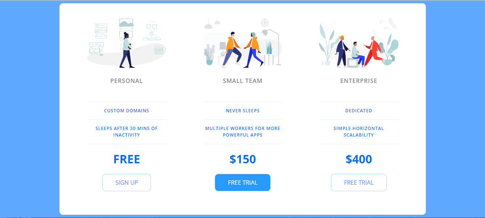
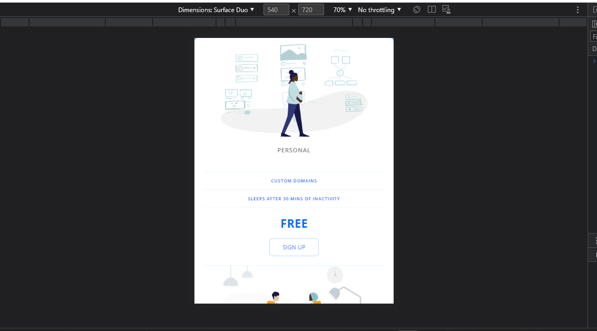

## Pricing Panel

___
Following the [Udemy tutorial](https://www.udemy.com/course/the-web-developer-bootcamp/), we were able to successfully build a simple pricing table based on [Travis Williamson](https://codepen.io/travisw) [codepen](https://codepen.io/travisw/pen/EvbKwd) work. 

To accomplish this, we utilized basic CSS in conjunction with Flexbox and responsive design techniques.

Desktop layout
___

Mobile layout
___

This project was created only for educational purposes.